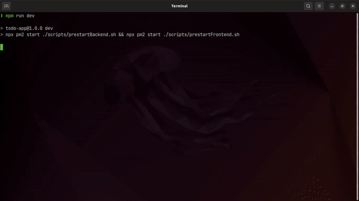

# Todo List

  ## Screenshot


## Descrição
Um projeto para gerenciar atividades. Um site vinculado a um server onde a partir do frontend se pode de criar, editar e deletar items que estão no banco de dados.

## Tecnologias
Principais tecnologias utilizadas neste projeto foram: [Node](https://nodejs.org "Node"), [JavaScript](https://developer.mozilla.org/en-US/docs/Web/JavaScript "JavaScript"), [ESLint](https://eslint.org/ "EsLint"), [Node](https://nodejs.org "Node"), [Express](https://expressjs.com/ "Express"), [MongoDB](https://www.mongodb.com/ "mongoDB"), [Mongoose](https://mongoosejs.com/ "MongooseJS"), [React](https://reactjs.org/ "React"),[Axios](https://www.npmjs.com/package/axios "Axios") e [pm2](https://pm2.keymetrics.io/docs/usage/quick-start/ "pm2").

## Clone
1. Para rodar este projeto em sua máquina, tenha: **node** e **mongodb** instalado e configurado em sua máquina.
2. Clone este projeto ou via git, rode no terminal:  `git clone git@github.com:Dogl4/todo-app.git`,  ou baixe .zipado  [aqui](https:github.com/Dogl4/todo-app/archive/refs/heads/master.zip).

## Comandos
 No terminal, na raiz deste projeto rode estes comandos para iniciar a aplicação.
```bash
npm install
```
```bash
npm run dev
```
Se tudo ocorrer bem, uma nova página no seu browser será carregada. Se quiser parar a aplicação, rode o seguinte comando:
```bash
npm run stop
```
## Status do projeto
  🚧 Em andamento

## Contribuintes
<table>
	<tr  style="width:120px">
		<td  align="center">
			<a  target=”_blank” href="https://github.com/Dogl4">
				<br>
				<sub>
					<b>Pedro Barreto</b>
				</sub>
			</a>
		</td>
	</tr>
</table>
